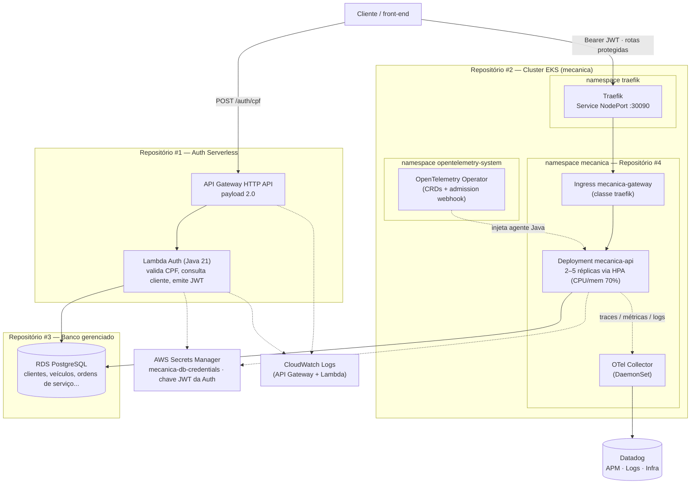

# Diagrama de Componentes

Visão da nuvem inteira: API Gateway, Function Serverless de autenticação,
cluster Kubernetes (gateway, observabilidade e aplicação), banco de dados
gerenciado e ferramentas de monitoramento — exigida pelo enunciado do Tech
Challenge — Fase 3.

## Notas de leitura

- **Dois pontos de entrada distintos.** O **API Gateway da AWS** atende
  exclusivamente `POST /auth/cpf` (repositório #1); todas as demais rotas —
  inclusive as protegidas por JWT — passam pelo **Traefik**, instalado no
  cluster pelo repositório #2 e roteado por um `Ingress` declarado no
  repositório #4. Não há um gateway único para toda a solução; é uma decisão
  registrada no repositório #2
  ([ADR-003](https://github.com/FIAP-SOAT-MECANICA/fiap-soat-mecanica-api-k8s/blob/main/docs/adr/ADR-003-traefik-api-gateway.md))
  e no repositório #4
  ([ADR-008](../adr/ADR-008-ingress-traefik.md)).
- **Dois emissores de JWT.** Usuários internos (`ATENDENTE`, `MECANICO`,
  `ALMOXARIFE`) autenticam por e-mail/senha direto na API; clientes
  autenticam por CPF na Lambda. A API valida os dois com segredos
  independentes — ver
  [ADR-003 da aplicação](../adr/ADR-003-jwt-dois-emissores.md).
- **Segredos nunca em código.** A senha do RDS e a chave JWT da Auth ficam no
  AWS Secrets Manager e só chegam ao pod como `Secret` Kubernetes em tempo de
  deploy — ver
  [ADR-007](../adr/ADR-007-deploy-eks-kubectl-secrets-manager.md).
- **Observabilidade unificada.** O `OpenTelemetryCollector` roda como
  DaemonSet (uma réplica por node), agrega `hostmetrics`/`kubelet_stats` (CPU
  e memória do Kubernetes) e os traces/métricas/logs da API instrumentada
  automaticamente, exportando tudo para o Datadog — ver
  [ADR-009](../adr/ADR-009-otel-collector-instrumentation-datadog.md).
- **Sem endpoint público estável.** O Traefik está exposto por `NodePort`
  (sem load balancer, por restrição de custo/IAM do Learner Lab); a validação
  da pipeline e a demonstração usam `kubectl port-forward` — ver
  [RFC-001](../rfc/RFC-001-api-eks-learner-lab.md).
