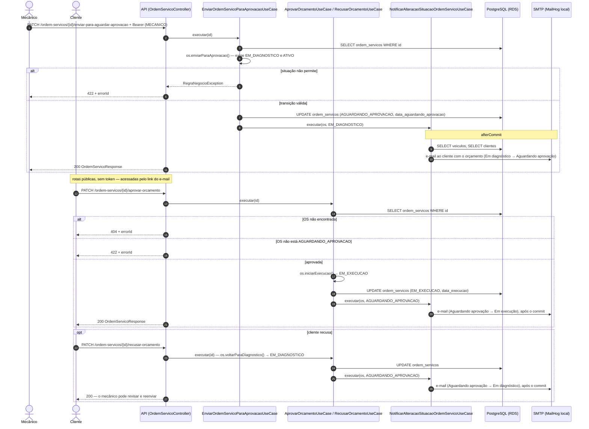

# Diagrama de sequência — abertura de ordem de serviço

Fluxo consolidado `POST /ordem-servicos/abrir`, que cria a OS com serviços
e peças em uma única transação, e o ciclo de orçamento que vem em seguida
(envio para aprovação e aprovação pelo cliente). Os nomes são os das classes
reais; os status HTTP vêm do `GlobalExceptionHandler`.

Decisões relacionadas: [ADR-001](../adr/ADR-001-clean-architecture-hexagonal.md),
[ADR-004](../adr/ADR-004-notificacao-email-pos-commit.md) e
[ADR-010](../adr/ADR-010-logs-estruturados-request-id.md). A autenticação
do mecânico está em [sequencia-autenticacao.md](sequencia-autenticacao.md).

## 1. Abertura consolidada da OS

```mermaid
sequenceDiagram
    autonumber
    actor Mecanico as Mecânico
    participant Traefik as Traefik (gateway, repo -k8s)
    participant Filtros as Filtros (X-Request-Id + JWT)
    participant Ctrl as OrdemServicoController
    participant Abrir as AbrirOrdemServicoUseCase
    participant OS as CadastrarOrdemServicoUseCase
    participant Prest as CadastrarPrestacaoServicoUseCase
    participant Aloc as CadastrarAlocacaoPecaUseCase
    participant Notif as NotificarAlteracaoSituacaoOrdemServicoUseCase
    participant DB as PostgreSQL (RDS, repo -db)
    participant SMTP as SMTP (MailHog local)

    Mecanico->>Traefik: POST /ordem-servicos/abrir (veiculoId, observacao, servicos[ ] com pecas[ ]) + Bearer
    Traefik->>Filtros: Ingress → Service mecanica-api:8080
    Filtros->>Filtros: requestId no MDC, token interno validado, ROLE_MECANICO
    Filtros->>Ctrl: @PreAuthorize hasRole('MECANICO'), @Valid (mínimo 1 serviço, preço > 0, quantidade ≥ 1)

    alt corpo inválido
        Ctrl-->>Mecanico: 400 Bad Request + errorId
    end

    Ctrl->>Abrir: executar(observacao, veiculoId, servicos)
    activate Abrir
    Note over Abrir,DB: @Transactional — uma única transação para tudo abaixo

    Abrir->>OS: executar(observacao, veiculoId)
    OS->>DB: SELECT usuarios WHERE email = sub do token (CurrentUserPort)
    OS->>OS: valida cargo MECANICO, new OrdemServico(situacao=RECEBIDA, status=ATIVO)
    OS->>DB: INSERT ordem_servicos
    OS->>OS: log order_service_created (orderServiceId, vehicleId, mechanicId)
    OS-->>Abrir: OS criada

    loop para cada serviço informado
        Abrir->>Prest: executar(precoMaoDeObra, osId, servicoId)
        Prest->>DB: SELECT servicos, SELECT ordem_servicos, EXISTS prestacao_servicos(os, servico)
        Prest->>Prest: valida ativo, não duplicado e situação que permite incluir serviço
        Prest->>DB: INSERT prestacao_servicos
        Prest->>Prest: os.adicionarValor(subtotal), se RECEBIDA → iniciarDiagnostico() (EM_DIAGNOSTICO)
        Prest->>DB: UPDATE ordem_servicos (valor_total, situacao, data_diagnostico)
        Prest->>Notif: executar(os, situacaoAnterior)
        Notif->>Notif: registra afterCommit (log + e-mail) apenas se a situação mudou
        Prest-->>Abrir: prestação criada

        loop para cada peça do serviço
            Abrir->>Aloc: executar(quantidade, prestacaoId, pecaId)
            Aloc->>DB: EXISTS alocacao_pecas(prestacao, peca), SELECT pecas, SELECT prestacao_servicos, SELECT ordem_servicos
            Aloc->>Aloc: prestacao.validarPodeAlterar(), os.validarPermiteAlterarDiagnostico()
            Aloc->>DB: INSERT alocacao_pecas
            Aloc->>Aloc: peca.baixarEstoque(quantidade) — falha se estoque insuficiente
            Aloc->>DB: UPDATE pecas (estoque)
            Aloc->>Aloc: prestacao.adicionarValorPeca(valorUnitario × quantidade), os.adicionarValor(valorPeca)
            Aloc->>DB: UPDATE prestacao_servicos, UPDATE ordem_servicos (valor_total)
            Aloc-->>Abrir: alocação criada
        end
    end

    Abrir->>DB: SELECT ordem_servicos WHERE id (OS completa)
    deactivate Abrir

    alt qualquer exceção dentro da transação
        Abrir-->>Ctrl: rollback total (nada de OS, prestação, alocação ou baixa de estoque fica gravado)
        Ctrl-->>Mecanico: 404 (recurso não encontrado) ou 422 (regra de negócio) + errorId
    else commit
        Note over Notif,SMTP: afterCommit — fora da transação
        Notif->>Notif: log order_service_status_changed (RECEBIDA → EM_DIAGNOSTICO)
        opt EMAIL_NOTIFICATIONS_ENABLED=true (Compose/Kind; desligado no EKS)
            Notif->>DB: SELECT veiculos, SELECT clientes (destinatário)
            Notif->>SMTP: e-mail "Atualização da ordem de serviço {id}" para o cliente
            Note right of SMTP: falha de envio só gera log, nunca altera a resposta
        end
        Ctrl-->>Traefik: 200 OrdemServicoResponse (situacao=EM_DIAGNOSTICO, valorTotal, prestações e alocações)
        Traefik-->>Mecanico: 200 + X-Request-Id
    end
```

Pontos que o diagrama torna visíveis:

- A OS nasce `RECEBIDA` e, como o endpoint consolidado exige ao menos um
  serviço, sai da chamada já em `EM_DIAGNOSTICO`.
- A baixa de estoque e a soma de valores acontecem na mesma transação da
  criação; qualquer erro (peça sem estoque, serviço inativo, veículo
  inexistente) desfaz tudo.
- O log de mudança de situação e o e-mail só são disparados depois do
  commit, então nunca avisam sobre uma OS que sofreu rollback.

## 2. Orçamento: envio para aprovação e resposta do cliente



Depois da execução, o fluxo segue com `FINALIZADA` (todas as prestações
concluídas) e `ENTREGUE` (`PATCH /ordem-servicos/{id}/pagar`), sempre com o
mesmo padrão: transição no domínio, `UPDATE`, notificação após o commit.
