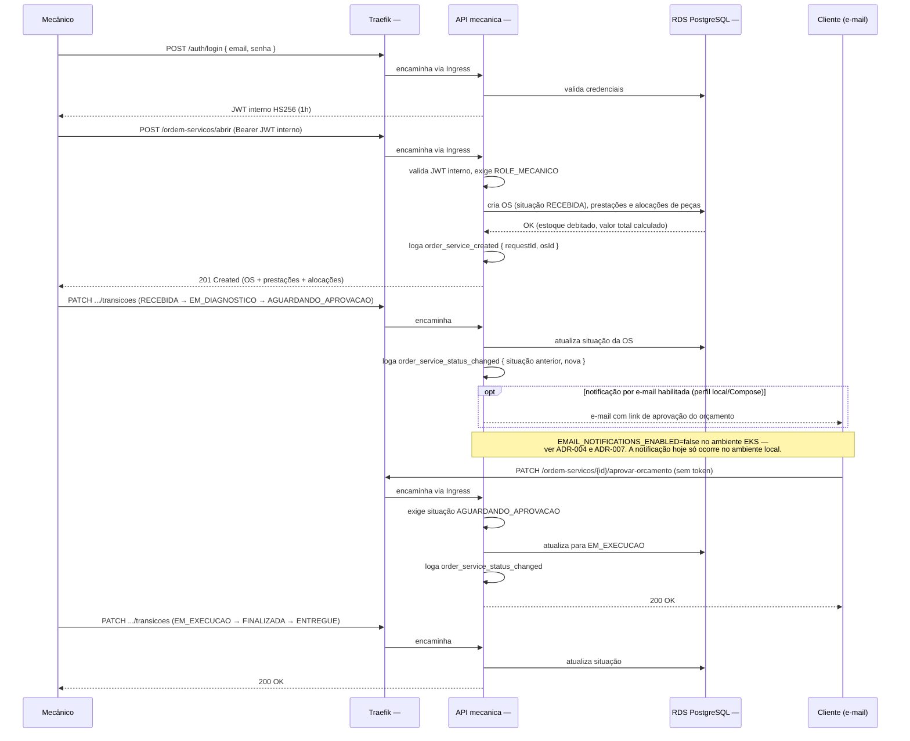

# Diagrama de Sequência — Abertura de Ordem de Serviço

Fluxo operacional principal da oficina: um usuário interno (`MECANICO`) abre
uma ordem de serviço já com serviços e peças, o sistema transiciona a
situação e, quando aplicável, notifica o cliente para aprovação do
orçamento.

## Notas de leitura

- A abertura de OS é uma operação de **usuário interno** (`ROLE_MECANICO`),
  autenticado por e-mail/senha — não usa o JWT de cliente emitido pela Auth
  serverless (ver o diagrama de
  [autenticação](sequencia-autenticacao.md)).
- Aprovar/recusar orçamento são as únicas rotas do fluxo que **não exigem
  token**: o cliente acessa por um link direto recebido por e-mail.
- **Notificação por e-mail está desabilitada no EKS.** A variável
  `EMAIL_NOTIFICATIONS_ENABLED=false` é definida explicitamente no deploy do
  cluster real ([ADR-004](../adr/ADR-004-notificacao-email-pos-commit.md) e
  [ADR-007](../adr/ADR-007-deploy-eks-kubectl-secrets-manager.md)). Isso
  significa que, no ambiente de produção do Learner Lab, o cliente não
  recebe automaticamente o link de aprovação — é uma limitação conhecida do
  grupo, não um erro deste diagrama. Ele reflete o comportamento real do
  sistema, incluindo essa lacuna.
- Cada transição de situação é logada como evento de negócio nomeado,
  correlacionado por `requestId` — ver
  [ADR-010](../adr/ADR-010-logs-estruturados-request-id.md). Com o agente
  OpenTelemetry injetado, o mesmo `traceId` aparece no log e no Datadog
  ([ADR-009](../adr/ADR-009-otel-collector-instrumentation-datadog.md)).
- Não há exclusão física: OS `FINALIZADA`/`ENTREGUE` ou com status
  `INATIVO` saem da fila operacional (`GET /ordem-servicos`), mas continuam
  persistidas e acessíveis pelos demais fluxos.
