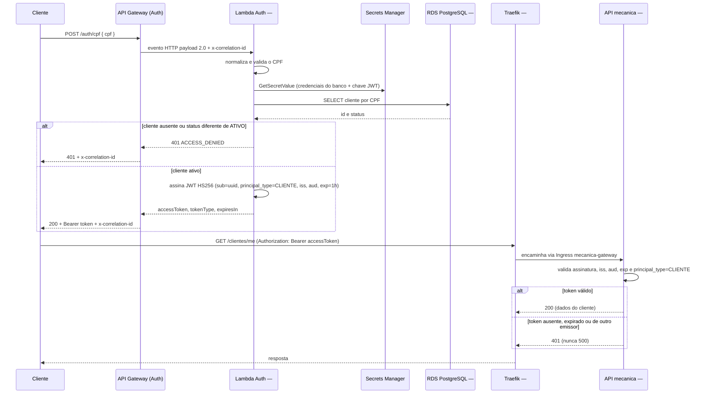

# Diagrama de Sequência — Autenticação

Cobre os dois momentos do requisito de autenticação: o cliente obtém um JWT
informando o CPF (repositório #1) e depois o usa para acessar uma rota
protegida da API (repositório #4), atravessando o Traefik (repositório #2).

## Notas de leitura

- O CPF aceita 11 dígitos ou a máscara `NNN.NNN.NNN-NN`; entrada inválida
  retorna `400` antes mesmo de consultar o banco. Cliente inexistente ou
  inativo usa o mesmo `401 ACCESS_DENIED` do CPF ausente, para não revelar se
  um CPF está cadastrado.
- O cabeçalho `x-correlation-id` é gerado pela Lambda quando o cliente não o
  envia, e devolvido em toda resposta — é o identificador que atravessa o
  repositório #1. Do lado da API (repositório #4), a correlação usa
  `X-Request-Id` ([ADR-010](../adr/ADR-010-logs-estruturados-request-id.md));
  os dois ainda não estão unificados — o cliente precisaria reenviar o
  mesmo valor como `X-Request-Id` para correlacionar as duas pontas, como
  registrado na [RFC-001](../rfc/RFC-001-api-eks-learner-lab.md).
- A API nunca chama a Lambda para validar o token: a validação é local,
  por assinatura e claims (`iss`, `aud`, `principal_type`) — ver
  [ADR-003](../adr/ADR-003-jwt-dois-emissores.md). Um token malformado ou
  expirado produz `401`/`403`, nunca `500`.
- Usuários internos (`ATENDENTE`, `MECANICO`, `ALMOXARIFE`) seguem um fluxo
  paralelo, não representado aqui: `POST /auth/login` com e-mail/senha
  direto na API, sem passar pela Lambda nem pelo API Gateway da AWS.
