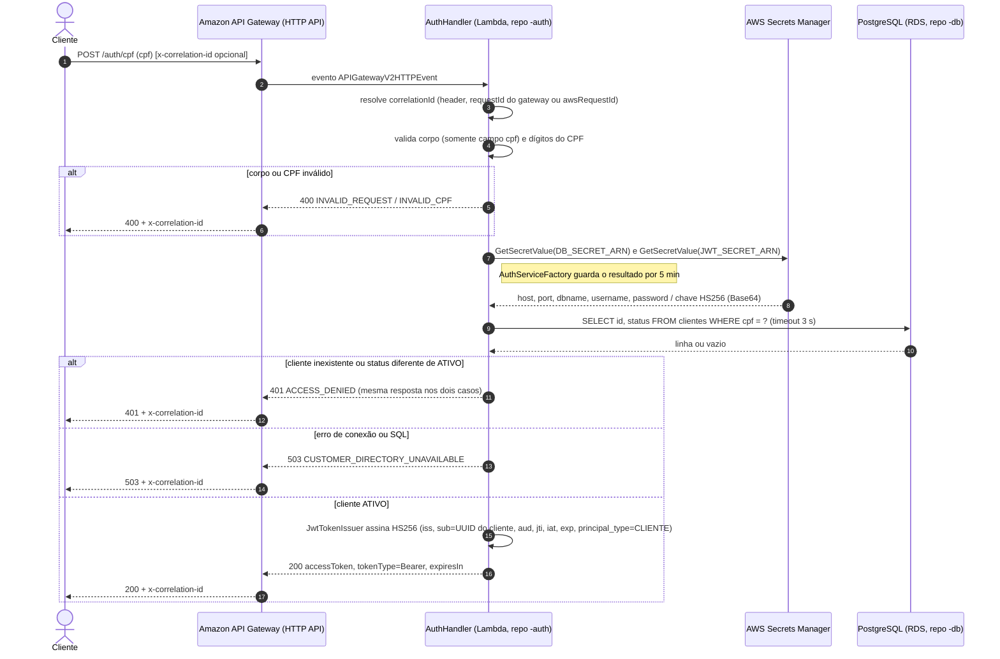
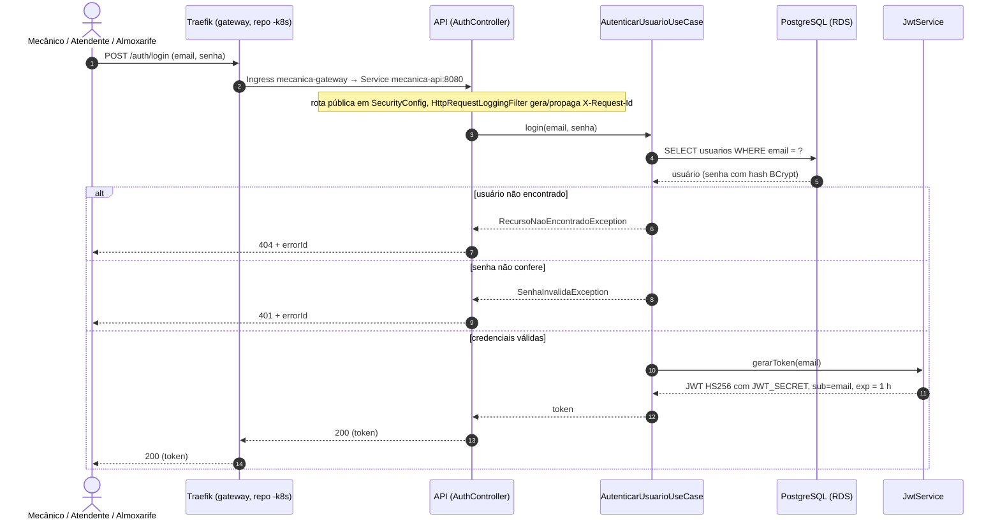
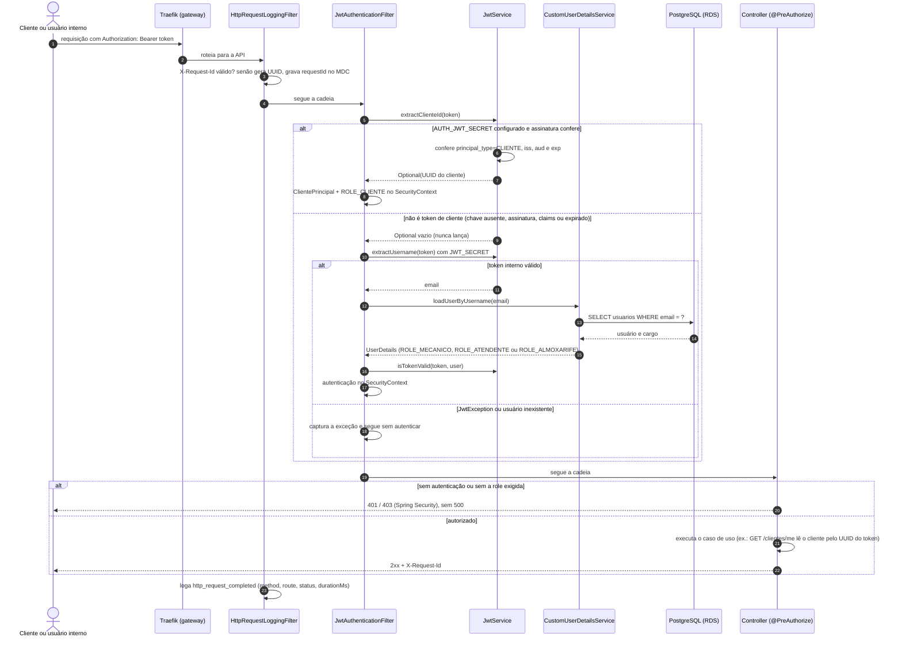

# Diagrama de sequência — autenticação

Fluxos de obtenção e validação de token da Mecânica do Braia, cobrindo os
quatro repositórios: a Function serverless (`fiap-soat-mecanica-api-auth`),
o cluster e o gateway (`fiap-soat-mecanica-api-k8s`), o banco gerenciado
(`fiap-soat-mecanica-api-db`) e esta API. As classes citadas são as reais;
os status HTTP vêm do `AuthHandler` (Lambda) e do `GlobalExceptionHandler`
(API).

Decisões relacionadas: [ADR-003](../adr/ADR-003-jwt-dois-emissores.md),
[ADR-008](../adr/ADR-008-ingress-traefik.md) e o contrato de integração no
repositório `-auth`.

## 1. Cliente obtém token por CPF (Auth serverless)

O `sub` do token é o UUID de `clientes.id`, nunca o CPF. A Lambda só faz
`SELECT`; a tabela `clientes` é criada pelas migrations desta API
([ADR-002](../adr/ADR-002-flyway-dono-do-schema.md)).

## 2. Usuário interno obtém token por e-mail e senha

## 3. Validação do `Authorization: Bearer` em qualquer rota protegida

O mesmo filtro atende os dois públicos. Ele tenta primeiro o token de
cliente e depois o interno; nenhuma falha de token vira 500.

Observação: a API devolve `X-Request-Id`, e a Lambda devolve
`x-correlation-id`. Para correlacionar as duas chamadas no Datadog, o cliente
precisa reenviar o valor recebido da Auth como `X-Request-Id` (pendência
registrada na [RFC-001](../rfc/RFC-001-api-eks-learner-lab.md)).
